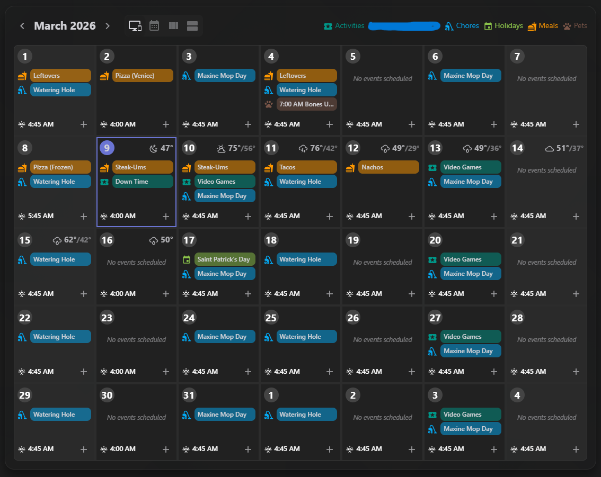
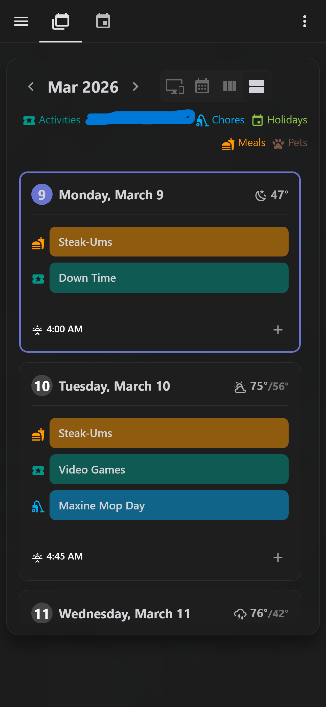

# Meal & Activity Planner Card

A highly customizable, responsive 7-day grid and mobile agenda calendar card for Home Assistant. Designed to manage household schedules, chores, meals, and activities with ease.




## Features
* **Fully Responsive:** Automatically seamlessly morphs between a 7-day Desktop Grid, a Squeezed Tablet Grid, and a Mobile Agenda list based on screen size.
* **Smart UI:** Highlights "Today", slightly dims weekends, and groups multi-day events intelligently.
* **Integrated Weather:** Automatically fetches and displays high/low temperatures and conditions from your chosen Home Assistant weather entity.
* **Custom Visual Editor:** No YAML required! Add calendars, pick custom colors, and drag-and-drop to reorder your daily event priorities right from the UI.
* **Smart Event Creation:** Streamlined "Wake up" event defaults, timezone-bulletproof date math, and native Home Assistant dialogs.

## Installation

### Method 1: HACS (Recommended)
1. Open HACS in your Home Assistant instance.
2. Click the three dots in the top right corner and select **Custom repositories**.
3. Add your GitHub repository URL and select the category **Lovelace**.
4. Click **Add**, then close the modal.
5. Search for "Meal & Activity Planner" and click **Download**.
6. When prompted, reload your browser.

### Method 2: Manual
1. Download the `planner-card.js` file from the `dist/` folder in this repository.
2. Copy it into your `config/www/` directory in Home Assistant.
3. Go to Settings > Dashboards > Click the three dots (top right) > Resources.
4. Click **Add Resource**.
5. Set the URL to `/local/planner-card.js` and the Resource Type to `JavaScript Module`.
6. Reload your browser.

## Configuration
Once installed, simply add the **Meal & Activity Planner** card to your dashboard via the visual editor. 

* **Weather Entity:** Select your local weather provider (e.g., `weather.forecast_home`).
* **Calendars & Colors:** Click "Add Calendar" to select an entity, pick its color using the native picker, and use the Up/Down arrows to set the visual priority for how events stack on the grid!

## Advanced (YAML)
If you prefer writing YAML, the structure looks like this:
```yaml
type: custom:meal-activity-planner
weather_entity: weather.your_home
calendars:
  - calendar.wake
  - calendar.meals
  - calendar.activities
colors:
  calendar.wake: "#FFFFFF"
  calendar.meals: "#FF9800"
  calendar.activities: "#00BCD4"